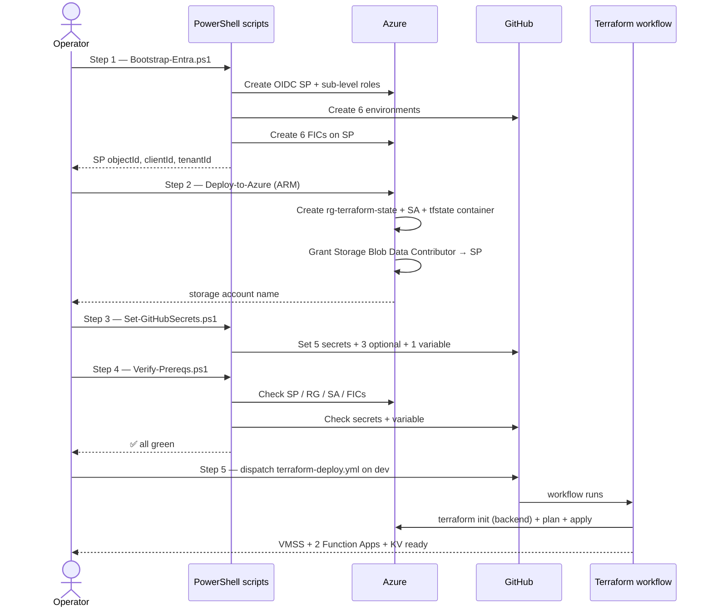

# Installation

Provision a GitHub self-hosted runner solution on Azure VMSS from a clean Azure subscription + clean GitHub organization in **five steps**.

You should be done in **20–40 minutes** if you have the right permissions in hand.

---

## Are you in the right place?

| If you are… | Go to |
|---|---|
| Installing for the first time on a fresh Azure sub + GitHub org | **[Step 1 — Bootstrap Entra](Step1-EntraBootstrap.md)** (start here) |
| Adopting an existing deploy (sub/org already has the runners) | See [`gh-vmss-img-runners/Pipelines/README.md`](../Pipelines/README.md) and the [`terraform/`](../terraform/) module docs |
| Switching to a new Azure subscription on an existing GitHub org | Start at **[Step 1](Step1-EntraBootstrap.md)** — `-SpName` and `-Environments` can match your existing values |
| Just running an `apply` for ongoing operations | Skip Installation. Dispatch [`terraform-deploy.yml`](../.github/workflows/terraform-deploy.yml) from the Actions tab |
| Switching the GitHub auth strategy from PAT to GitHub App (or v.v.) | See **[Appendix A — GitHub App auth](AppendixA-GitHubAppAuth.md)** |
| Stuck on a step | See **[Appendix B — Troubleshooting](AppendixB-Troubleshooting.md)** |

---

## Roles you need

You can split these across multiple people, or one operator can hold all of them.

| Role | System | Minimum permission | Used in |
|---|---|---|---|
| **Azure Subscription Owner** | Azure | Owner on the target subscription | Step 1 (SP creation + role assignment), Step 2 (ARM deploy) |
| **Entra ID Application Administrator** | Entra ID (Azure AD) | Application Administrator (or Cloud Application Admin) | Step 1 (SP + FIC creation) |
| **GitHub Repo Admin** | GitHub | Admin on the target repo | Step 1 (create environments), Step 3 (set secrets) |

> **Why Subscription Owner is required**: Step 1 assigns *Contributor* and *User Access Administrator* at subscription scope. Only an Owner can grant User Access Administrator. If your operator has lesser permissions, escalate to an Owner for Step 1, then they can step away — Steps 2-5 only need Contributor.

> **Why Application Administrator is required**: Step 1 creates a federated identity credential (FIC) on the SP. Service Principal owners and Application Administrators can create FICs; Global Reader cannot.

---

## Pre-flight checklist

Before you start Step 1, confirm you have:

- [ ] An Azure subscription with **Owner** (you, or someone available for Step 1)
- [ ] A GitHub organization (or user account) where this repo will live, with **Admin on the target repo**
- [ ] A fine-grained GitHub PAT to use as `GH_PAT` — see [Step 3](Step3-GitHubSecrets.md#mandatory-secrets) for required scopes
- [ ] A strong password for the VMSS local admin account (`VMSS_ADMIN_PASSWORD`) — 12+ chars, 3 of {upper, lower, digit, special}
- [ ] Local tools installed:
  - [ ] **Azure CLI** ≥ 2.54 — `az --version`
  - [ ] **GitHub CLI** ≥ 2.40 — `gh --version`
  - [ ] **PowerShell** ≥ 7.4 — `pwsh --version`
- [ ] Signed in to both CLIs:
  - [ ] `az login` (with an account that has Owner on the target sub)
  - [ ] `gh auth login` (with admin:org + admin:repo scopes on the target repo)

If any box is unchecked, fix that first.

---

## The five-step flow

| Step | File | Performed by | Outcome |
|---|---|---|---|
| **1** | [`Step1-EntraBootstrap.md`](Step1-EntraBootstrap.md) | Azure Owner + Entra App Admin + GitHub Repo Admin | OIDC service principal exists with the right roles + FICs; 6 GitHub environments exist |
| **2** | [`Step2-AzurePrereqs.md`](Step2-AzurePrereqs.md) | Azure Owner (or Contributor + UAA) | Terraform state backend exists (`rg-terraform-state` + storage account + `tfstate` container); SP has Blob Data Contributor on the SA |
| **3** | [`Step3-GitHubSecrets.md`](Step3-GitHubSecrets.md) | GitHub Repo Admin | The 5 mandatory secrets + 3 optional + 1 variable seeded on the repo |
| **4** | [`Step4-Verify.md`](Step4-Verify.md) | Anyone | Smoke check: all of the above present and consistent |
| **5** | [`Step5-FirstDeploy.md`](Step5-FirstDeploy.md) | GitHub Repo Admin | First `terraform-deploy.yml` run lands; VMSS + Function Apps + Key Vault are operational |

---

## Visual flow

---

## Conventions used in these docs

- **Code blocks** are copy-pasteable. Replace anything in `<angle-brackets>` with your values.
- **`> **Why ...:**` blockquote callouts** explain non-obvious permission requirements.
- **`> **Worked example`** callouts** at the bottom of each Step file capture the actual values used in the most recent live install (gets populated/refreshed during Phase B of this work). Treat them as reference, not prescription.
- **Filenames in `monospace`** are clickable links to files in this repo.
- **Outcomes** in script output use `[Created]` (green), `[Exists]` (yellow), `[Skipped]` (yellow), `[Set]` (green), `[FAIL]` (red).

---

## When something goes wrong

- The PowerShell scripts are **idempotent** — re-running them is safe. They detect existing state and skip with `[Exists]` markers.
- The ARM template uses an **incremental deployment** — re-running it doesn't tear anything down.
- If you're truly stuck, see **[Appendix B — Troubleshooting](AppendixB-Troubleshooting.md)** for failure modes grouped by step.

---

**Ready?** → **[Start at Step 1 — Bootstrap Entra](Step1-EntraBootstrap.md)**
